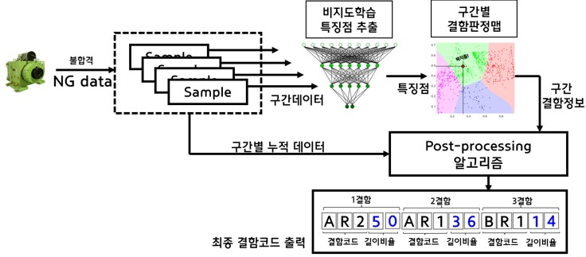
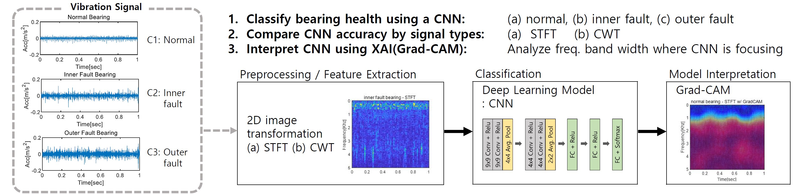
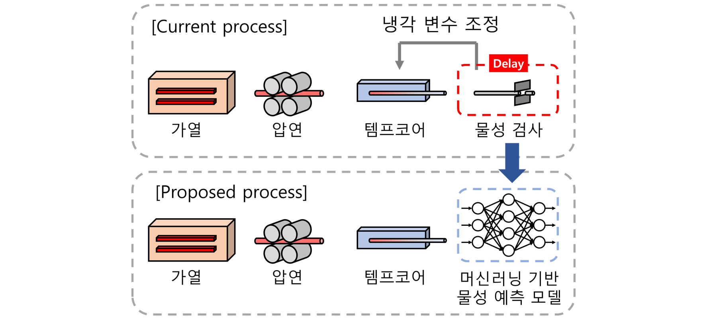
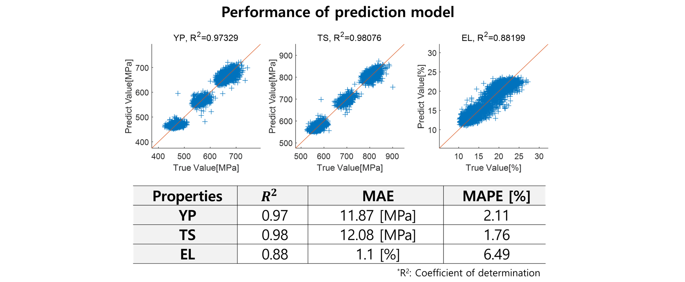

AI for Fault Diagnosis and Prediction, AI model for Quality Inspection, AI for Manufacturing Process

# Detection: 이상/고장 탐지 및 분류

## 1. Semi-Supervised Surface Defect Detection 
 **AI 기반 특수강 표면결함 분류작업 자동화 시스템 개발**  < [기사 출처](https://m.etnews.com/20220113000057)>
* 오토인코더 기반 반지도학습을 활용한 특수강 표면결함 분류 기법 기초 연구

  

  

* 결함분류 온라인 학습모델 개발 연구 (진행 중, 2022~)

## 2. Machinery Fault Monitoring

**회전체 결함 진단** 

* 볼베어링 결함진단 CNN 모델 개발 및 Grad-Cam 진단결과 해석

  

  

**Electric-Machinery 결함 진단** 

* 전류 신호 기반의 유도전동기 결함진단 MCSA(Motor Current Signature Analysis) 기법 연구 (진행 중)

  

---

  

 

# Prediction:  물성치/수명 예측

##  1. Prediction Model for Material Property

**특수강 공정 재료특성 예측 모델 개발**

Prediction model of Steel rod material property to optimize cooling control variables and replace sample tests to save production time

* 특수강 공정 재료특성 예측 모델 개발: Tensile Strength/ Yield Point / Elongation

* 냉각 공정 변수 최적화 모델 개발(진행 중)

##  2. 데이터 기반의 기계부품 잔류 수명 예측  

회전체 부품 등 기계부품의  Remaining Useful Life (RUL) 예측 

##  3. 스마트 주차 안내 시스템: Prediction Model for Parking Free Space with Limited Number of CCTV

CCTV 정보 기반의 포항시 스마트 시티 주차안내 시스템 - 주차 여유 공간 예측 알고리즘 개발

>  WeSEE X HGU SSS Lab

<iframe width="560" height="315" src="https://www.youtube.com/embed/MpNni2Jw3Zk" title="YouTube video player" frameborder="0" allow="accelerometer; autoplay; clipboard-write; encrypted-media; gyroscope; picture-in-picture" allowfullscreen></iframe>

 

# Optimization : 최적화

##  1. 산업체 교대근무 스케쥴링 최적화 

**강화학습 기반의  교대근무 스케쥴링 최적화 연구**

(진행 중)

##  2. 공정 입력변수 최적화 모델

**특수강 템프코어 공정 냉각변수 최적화 연구**

Prediction model of Steel rod material property to optimize cooling control variables and replace sample tests to save production time

(진행 중)

---
# Others 
## 1. EEG-inception model

Accurate and robust end-to-end neural network for electroencephalography(EEG) based motor imagery classification.

* Zhang, Ce, Young-Keun Kim, and Azim Eskandarian. "EEG-inception: an accurate and robust end-to-end neural network for EEG-based motor imagery classification." Journal of Neural Engineering 18.4 (2021): 046014. 

