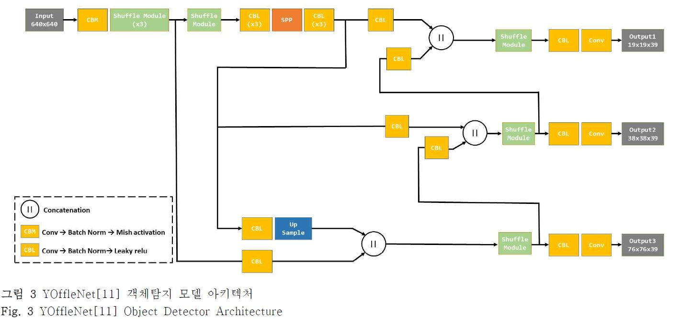
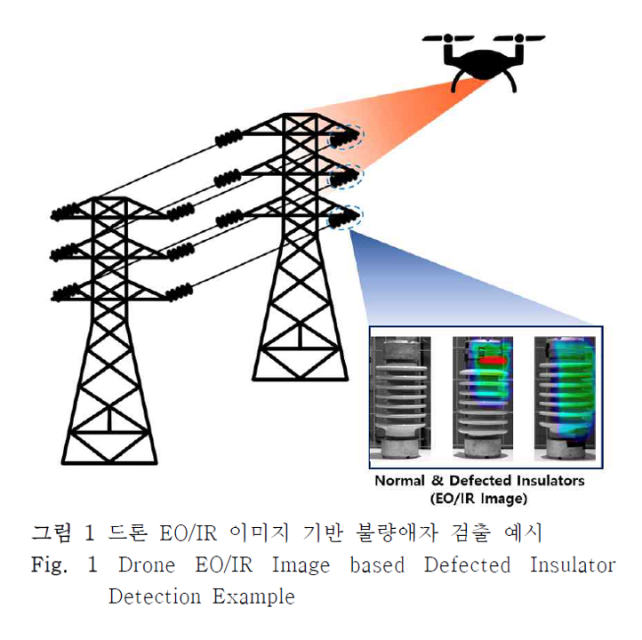
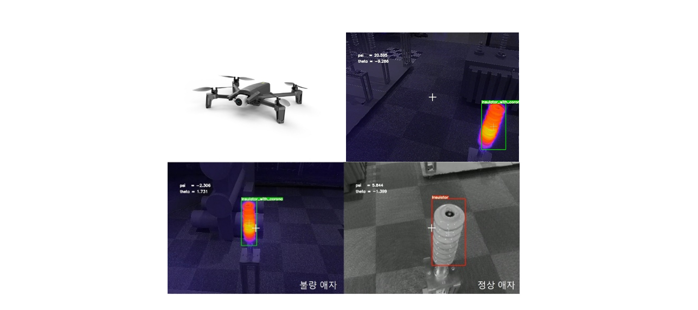
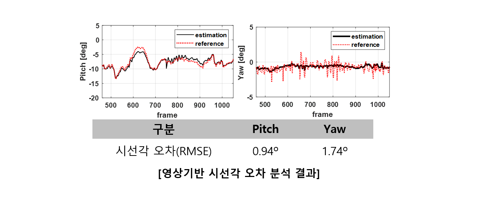
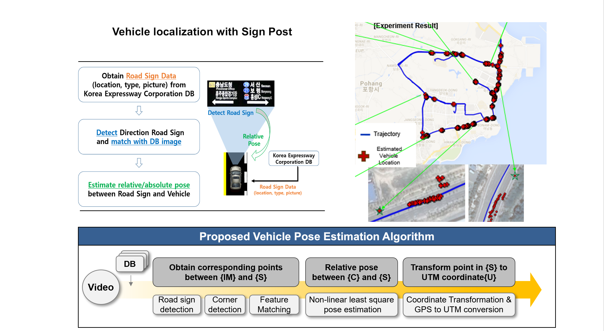
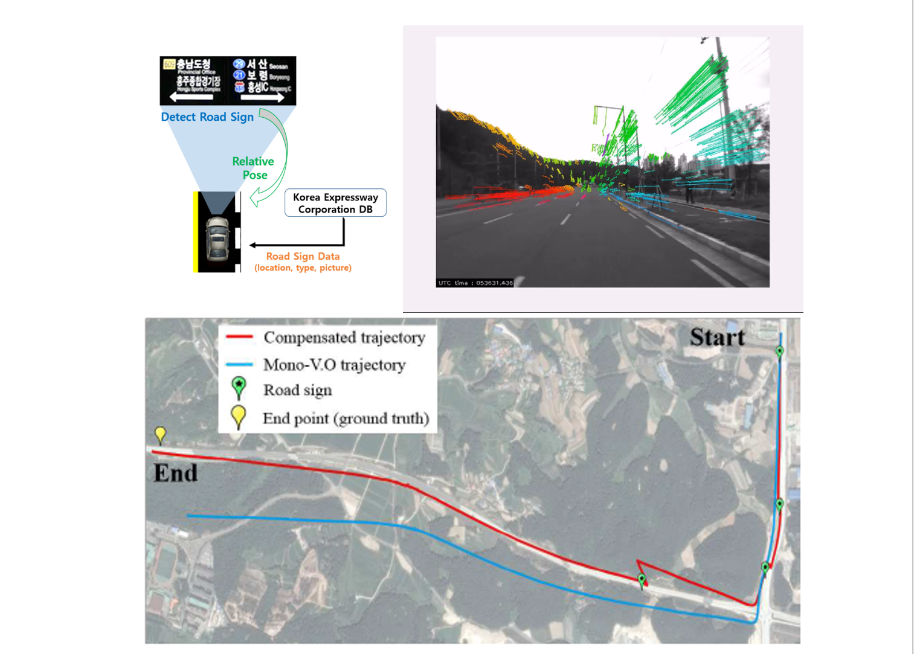

 

 

#  2D Object Detection

## 1. Light-Weight Object Detection for Embedded System

An object detection model that is compressed at a high ratio while minimizing the accuracy loss for real-time and safe driving application on an autonomous system.

* **YoffleNet:** Light-Weight Object Detection for Embedded System
  * 자율주행용 임베디드 플랫폼 탑재를 위한 YOLOv4 기반 객체탐지 경량화 모델 개발. 한국자동차공학회논문집, 29(10), 959-966.

* **[YOffleNet & Deep Sort for Tracking and Counting People](https://github.com/hkim1207/2021MIP)**

 

## 2. Detection Model for Drone EO/IR Camera

드론 임베디드 시스템 탑재를 위한 경량화된 객체탐지 모델 개발 열화상 이미지 기반 변전소 애자 고장 검출

* **Thermal Image 기반 변전소 애자 고장 검출(Detection model for Substation Insulators Defects )**
  * "Development of a Compressed Deep Neural Network for Detecting Defected Electrical Substation Insulators using a Drone", Journal of Institute of Control, Robotics and Systems, vol.26 no.11, 2020

* **RGB+Thermal blend 이미지 기반 변전소 애자 고장 검출**

  

  

  

* **고장애자 객체 드론 시선각 추정**

  

## 3.  Mono-Visual SLAM with Signpost

* **도로 표지판 온라인 데이터베이스  이용 자동차 위치 추정 알고리즘**
  * Drift Compensation Of Mono-Visual Odometry And Vehicle Localization Using Public Road Sign Database, International Journal Of Automotive Technology, vol20, no.6, 2019 

* **도로 표지판 이용한 Visual Odometry 드리프트 보정 알고리즘**

 

 

# Machine Vision for Smart Factory

## 1. RGB-D 카메라 기반 체적 측정 시스템

사무실용 저가격/고해상도 체적 측정 시스템 개발을 위한 3D 카메라 기반 정형/비정형 물체 부피 측정 알고리즘 개발 (2019)

*  화물을 포함하는 최소 크기의 직육면체의 가로, 세로, 높이로 표현

* 해상도 및 정확도: 직육면체 ±5mm, 비정형 ±10mm 이내 만족

* 사각 50x50x50 ~ 600x600x600 mm$^3$,  원통 $\phi$  30 x 30 cm 

  

## 2. FPGA 기반 고속 기어 검사 시스템

기어 검수 알고리즘의 병목현상을 FPGA 설계 및 데이터 개수 최소화 등의 방법을 통해 5.6배의 가속화

* 오선택, 유지환, 김영근.(2019).고속 임베디드 기어 검사 시스템을 위한 불량 검출 알고리즘 FPGA 가속화 연구.제어로봇시스템학회 논문지,25(8),665-670.

------

  

