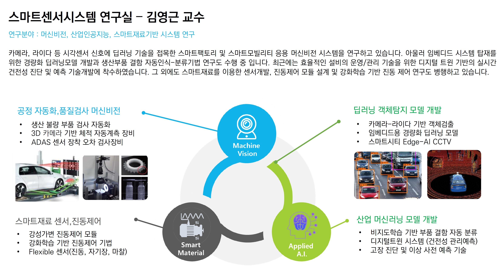

------

------

 

 

------
# Highlights





------

 

# Contact

**스마트센서시스템 연구실**

경북 포항시 북구 흥해읍 한동대학교 한동로 558 뉴턴홀 107호, 37554 

[ykkim@handong.edu]:ykkim@handong.edu

tel: 054-260-1438

 

**Smart Sensor System Lab**

NewtonHall 107

Handong Global University, 558 Handong-ro Buk-gu, 

Pohang Gyeongbuk 37554 

Republic of Korea

------

 

## Direction

<iframe src="https://www.google.com/maps/embed?pb=!1m18!1m12!1m3!1d3223.5990333686555!2d129.3848326152027!3d36.10326118009798!2m3!1f0!2f0!3f0!3m2!1i1024!2i768!4f13.1!3m3!1m2!1s0x35671cb7438539d5%3A0x57754b36fb449152!2z7ZWc64-Z64yA7ZWZ6rWQIOuJtO2EtO2ZgA!5e0!3m2!1sko!2skr!4v1644142213378!5m2!1sko!2skr" width="600" height="450" style="border:0;" allowfullscreen="" loading="lazy"></iframe>

